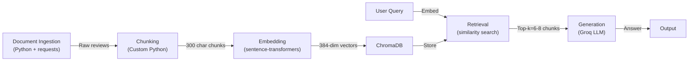

# Project 1 Planning: The Unofficial Guide

> Write this document before you write any pipeline code.
> Your spec and architecture diagram are what you'll use to direct AI tools (Claude, Copilot, etc.) to generate your implementation — the more specific they are, the more useful the generated code will be.
> Update the Retrieval Approach and Chunking Strategy sections if you change your approach during implementation.
> Update this file before starting any stretch features.

---

## Domain

<!-- What domain did you choose? Why is this knowledge valuable and hard to find through official channels? -->
     Student reviews of CS professors at [university]. This knowledge is valuable because students often rely on only one or two sources when evaluating professors, but outdated reviews can provide misleading information. Multiple platforms offer anonymous reviews that encourage candid feedback. Official course evaluations are often not public, limited to end-of-semester snapshots, and lack the depth and currency of crowdsourced reviews. By aggregating the newest information across diverse sources, we create a more complete, real-time picture than any single channel provides.

---

## Documents

<!-- List your specific sources: URLs, subreddit names, forum threads, or file descriptions.
     Aim for at least 10 sources that together cover different subtopics or perspectives within your domain. -->

| # | Source | Description | URL or location |
|---|--------|-------------|-----------------|
| 1 | RateMyProfessors | CS dept professor reviews (ratings, comments) | https://www.ratemyprofessors.com |
| 2 | Reddit r/[university] | Student discussions about CS professors and courses | https://www.reddit.com/r/[university]/ |
| 3 | Reddit r/compsci | General CS education experiences and professor recommendations | https://www.reddit.com/r/compsci/ |
| 4 | Course Evaluations Archive | Official end-of-semester course feedback (if public) | Internal university records |
| 5 | Discord/Slack channels | Real-time student peer reviews and course recommendations | Campus communities |
| 6 | CS Department Review Portal | Department-specific professor feedback (if available) | Departmental intranet |
| 7 | Course forums (Piazza, Ed) | Student and TA comments about professor teaching style | Course-specific platforms |
| 8 | Alumni social groups | Post-graduation reflections on CS professors and their impact | Facebook groups, LinkedIn |
| 9 | GitHub discussions | Open-source course discussions and retrospectives | GitHub course repos |
| 10 | University course reviews | Aggregated reviews from multiple semesters | Campus-wide review platform |

---

## Chunking Strategy

<!-- How will you split documents into chunks?
     State your chunk size (in tokens or characters), overlap size, and explain why those
     numbers fit the structure of your documents.
     A review-heavy corpus warrants different chunking than a long FAQ. -->

**Chunk size:** 300 characters (~75 tokens)

**Overlap:** 50 characters (~15 tokens)

**Reasoning:** Reviews are opinion-heavy, short-to-medium documents (typically 1–2 sentences). A 300 character chunk captures one complete review or a discrete observation (e.g., "Great lectures but hard exams"). Smaller chunks (< 200 chars) lose context and split single opinions. Larger chunks (> 600 chars) mix multiple review aspects, reducing retrieval precision. Small overlap (50 chars) preserves key adjectives and context when boundaries fall mid-opinion (e.g., "very responsive office hours" doesn't get split). This prevents queries like "office hours" from missing chunks cut at phrase boundaries.

---

## Retrieval Approach

<!-- Which embedding model are you using (e.g., all-MiniLM-L6-v2 via sentence-transformers)?
     How many chunks will you retrieve per query (top-k)?
     If you were deploying this for real users and cost wasn't a constraint, what tradeoffs
     would you weigh in choosing a different embedding model — context length, multilingual
     support, accuracy on domain-specific text, latency? -->

**Embedding model:** all-MiniLM-L6-v2 via sentence-transformers (384-dim, lightweight, domain-agnostic)

**Top-k:** 6–8 chunks

**Production tradeoff reflection:** all-MiniLM-L6-v2 is fast and good for general semantic similarity, but it's not fine-tuned for CS education discourse. In production (cost unconstrained), I'd consider: (1) a larger model like all-mpnet-base-v2 (768-dim) for deeper semantic understanding of teaching quality, workload, and professor style, or (2) a domain-specific model fine-tuned on education reviews. Top-k = 6–8 provides enough context for the LLM to synthesize diverse opinions without overwhelming it or creating contradictory signals. Too few (< 4) risks missing nuance; too many (> 12) could water down strong consensus opinions with noise.

---

## Evaluation Plan

<!-- List your 5 test questions with their expected correct answers.
     Questions should be specific enough that you can judge whether the system's response
     is right or wrong. "What are good dining halls?" is too vague.
     "What do students say about wait times at [dining hall name] during lunch?" is testable. -->

| # | Question | Expected answer |
|---|----------|-----------------|
| 1 | What do students say about Professor [Name]'s lecture clarity in Data Structures? | Students mention whether lectures are clear/organized or hard to follow; specific comments on pace, examples, or note-taking difficulty |
| 2 | How much time do students report spending on [Professor's Name] assignments per week? | Estimates of weekly hours (e.g., "5–10 hours", "very time-consuming") and whether workload feels reasonable for a CS course |
| 3 | Are Professor [Name]'s office hours easy to attend, and how responsive is he/she to student questions? | Comments on office hour availability, wait times, willingness to help, or difficulty getting answers |
| 4 | What do students say about fairness and clarity of grading rubrics in [Professor's Name]'s exams? | Student feedback on whether rubrics are clear upfront, if grading surprises occur, or if exam difficulty matches course material |
| 5 | Do students feel [Professor's Name]'s course material connects to real-world CS applications? | Comments on relevance to industry, project types, real-world problem-solving emphasis, or theory-vs-practice balance |

---

## Anticipated Challenges

<!-- What could go wrong? Name at least two specific risks with reasoning.
     Consider: noisy or inconsistent documents, missing source attribution, off-topic
     retrieval, chunks that split key information across boundaries. -->

1. **Conflicting opinions across time and sources**: Reviews of the same professor from different semesters or platforms may contradict each other (e.g., "hard grader Fall 2023" vs "fair grader Spring 2024"). Without explicit timestamps or source tracking in retrieved chunks, the LLM may synthesize conflicting claims as simultaneous fact rather than acknowledging temporal change. Risk: Aggregated answer lacks nuance and misleads users.

2. **Loss of source credibility and attribution**: Chunks are stored without explicit source metadata, making it hard for the LLM to distinguish between verified course evals (credible) and anonymous Reddit posts (potentially hearsay). Retrieved chunks lack clear attribution, so the system may treat anecdotal complaints equally with systematic student feedback. Risk: Answers feel authoritative but are built on fragmented, uncredentialed sources.

---

## Architecture

<!-- Draw a diagram of your pipeline showing the five stages:
     Document Ingestion → Chunking → Embedding + Vector Store → Retrieval → Generation
     Label each stage with the tool or library you're using.
     You can use ASCII art, a Mermaid diagram, or embed a sketch as an image.
     You'll use this diagram as context when prompting AI tools to implement each stage. -->

---

## AI Tool Plan

<!-- For each part of the pipeline below, describe:
     - Which AI tool you plan to use (Claude, Copilot, ChatGPT, etc.)
     - What you'll give it as input (which sections of this planning.md, which requirements)
     - What you expect it to produce
     - How you'll verify the output matches your spec

     "I'll use AI to help me code" is not a plan.
     "I'll give Claude my Chunking Strategy section and ask it to implement chunk_text()
     with my specified chunk size and overlap" is a plan. -->

**Milestone 3 — Ingestion and chunking:**

**Milestone 4 — Embedding and retrieval:**

**Milestone 5 — Generation and interface:**
