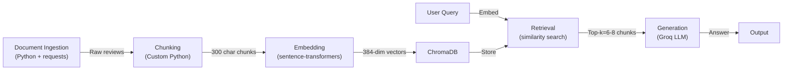

# Project 1 Planning: The Unofficial Guide

> Write this document before you write any pipeline code.
> Your spec and architecture diagram are what you'll use to direct AI tools (Claude, Copilot, etc.) to generate your implementation — the more specific they are, the more useful the generated code will be.
> Update the Retrieval Approach and Chunking Strategy sections if you change your approach during implementation.
> Update this file before starting any stretch features.

---

## Domain

<!-- What domain did you choose? Why is this knowledge valuable and hard to find through official channels? -->
     Student reviews of Computer Science professors at Hunter College (CUNY). This knowledge is valuable because students often rely on only one or two sources when evaluating professors, but outdated reviews can provide misleading information. Multiple platforms offer anonymous reviews that encourage candid feedback. Official course evaluations are often not public, limited to end-of-semester snapshots, and lack the depth and currency of crowdsourced reviews. By aggregating the newest information across diverse sources, we create a more complete, real-time picture than any single channel provides.

---

## Documents

<!-- List your specific sources: URLs, subreddit names, forum threads, or file descriptions.
     Aim for at least 10 sources that together cover different subtopics or perspectives within your domain. -->

All sources are saved as text files in `documents/`. The corpus deliberately spans high-rated (5.0, 4.2, 4.0), mixed (3.7, 3.8, 2.6), and low-rated (2.1–2.3) professors so the system can answer comparative questions, plus one official syllabus for ground-truth course context.

| # | Source | Description | URL / file |
|---|--------|-------------|------------|
| 1 | RateMyProfessors — Raffi Khatchadourian | CSCI 335; 4.2/5, 82% take-again. Career-focused, caring | [link](https://www.ratemyprofessors.com/professor/2259095) → `documents/01_khatchadourian_rmp.txt` |
| 2 | RateMyProfessors — Susan Epstein | CSCI 150/353; 2.1/5, 16% take-again. Tough, unclear rubric | [link](https://www.ratemyprofessors.com/professor/192300) → `documents/02_susan_epstein_rmp.txt` |
| 3 | RateMyProfessors — Eric Schweitzer | CSCI 265; 2.6/5. Pop quizzes, polarizing | [link](https://www.ratemyprofessors.com/professor/257192) → `documents/03_schweitzer_rmp.txt` |
| 4 | RateMyProfessors — Jeff Epstein | CSCI 135/235; 3.7/5. Clear explainer, mixed reviews over time | [link](https://www.ratemyprofessors.com/professor/1280182) → `documents/04_jeff_epstein_rmp.txt` |
| 5 | RateMyProfessors — Katherine St. John | CSCI 127; 2.3/5. Heavy workload, clear criteria | [link](https://www.ratemyprofessors.com/professor/2324096) → `documents/05_st_john_rmp.txt` |
| 6 | RateMyProfessors — Raj Korpan | CSCI 150/499; 4.0/5, 80% take-again. Fair grading, helpful | [link](https://www.ratemyprofessors.com/professor/2659561) → `documents/06_korpan_rmp.txt` |
| 7 | RateMyProfessors — Mahdi Makki | CSCI 435; 5.0/5, 100% take-again. Industry insights | [link](https://www.ratemyprofessors.com/professor/2157279) → `documents/07_makki_rmp.txt` |
| 8 | RateMyProfessors — Khant Ko Naing | CSCI 135; 3.8/5. Helpful, organized lectures | [link](https://www.ratemyprofessors.com/professor/2693848) → `documents/08_ko_naing_rmp.txt` |
| 9 | RateMyProfessors — Tong Yi | CSCI 13500; 2.2/5. Tough grader, lecture clarity complaints | [link](https://www.ratemyprofessors.com/professor/2634841) → `documents/09_tong_yi_rmp.txt` |
| 10 | CSCI 13500 Syllabus (Tong Yi) | Official course doc: ~15–20 hrs/week workload expectation | [link](https://tong-yee.github.io/135/syllabus_135_s21.html) → `documents/10_csci135_syllabus.txt` |

---

## Chunking Strategy

<!-- How will you split documents into chunks?
     State your chunk size (in tokens or characters), overlap size, and explain why those
     numbers fit the structure of your documents.
     A review-heavy corpus warrants different chunking than a long FAQ. -->

**Chunk size:** 300 characters target (~75 tokens)

**Overlap:** 0 characters (changed from 50 during implementation — see below)

**Reasoning:** Reviews are opinion-heavy, short-to-medium documents (typically 1–2 sentences). A 300 character chunk captures one complete review or a discrete observation (e.g., "Great lectures but hard exams"). Smaller chunks (< 200 chars) lose context and split single opinions. Larger chunks (> 600 chars) mix multiple review aspects, reducing retrieval precision.

**Implementation notes (Milestone 3, `ingest.py`):**

- **Boundary-aware packing, not blind character slicing.** The chunker packs whole review lines (reviews) or whole paragraphs (syllabus prose, which is hard-wrapped mid-sentence) up to the ~300-char target, never cutting a word or opinion in half. An early blind-slice version produced fragments like `"KE AGAIN: 82% | DIFFICULTY..."`; boundary packing eliminates them.
- **Overlap changed 50 → 0.** The original 50-char overlap existed to avoid splitting a single opinion across a boundary. Because boundary-aware packing already guarantees opinions are never split mid-thought, overlap is redundant — and a literal character overlap only duplicated whole reviews across adjacent chunks (the same opinion retrieved twice) or re-introduced mid-word fragments. So overlap is set to 0. (`CHUNK_OVERLAP` is still a parameter; the packing loop has a documented hook to carry trailing units if a future, longer-form source needs it.)
- **Header boilerplate stripped to metadata.** The `SOURCE:/PROFESSOR:/DEPARTMENT:/URL:/OVERALL RATING:` header on every file is boilerplate, not content — it was producing useless metadata-only chunks. It is now parsed into chunk metadata (`source`, `professor`, `doc_type`) and dropped from the chunk body.
- **Per-chunk context prefix for self-containment.** Each chunk is prefixed with `Professor <name>, RateMyProfessors — <rating>.` (or the syllabus title). This directly addresses Anticipated Challenge #2 (attribution loss): a chunk like "Her accent is hard to understand" is meaningless without the professor's name, so the name + rating travel with every chunk and are embedded alongside the opinion.

**Final chunk count:** 42 chunks across 10 documents (avg ~224 chars, range 118–316; 0 empty). This is below the 50-chunk rule-of-thumb, which is expected here: the corpus is genuinely small (~8 KB of text total), and packing 1–3 short reviews per 300-char chunk is the right granularity for this content — shrinking chunks further to clear 50 would split single opinions, which the strategy above explicitly avoids.

---

## Retrieval Approach

<!-- Which embedding model are you using (e.g., all-MiniLM-L6-v2 via sentence-transformers)?
     How many chunks will you retrieve per query (top-k)?
     If you were deploying this for real users and cost wasn't a constraint, what tradeoffs
     would you weigh in choosing a different embedding model — context length, multilingual
     support, accuracy on domain-specific text, latency? -->

**Embedding model:** all-MiniLM-L6-v2 via sentence-transformers (384-dim, lightweight, domain-agnostic)

**Top-k:** 6–8 chunks

**Production tradeoff reflection:** all-MiniLM-L6-v2 is fast and good for general semantic similarity, but it's not fine-tuned for CS education discourse. In production (cost unconstrained), I'd consider: (1) a larger model like all-mpnet-base-v2 (768-dim) for deeper semantic understanding of teaching quality, workload, and professor style, or (2) a domain-specific model fine-tuned on education reviews. Top-k = 6–8 provides enough context for the LLM to synthesize diverse opinions without overwhelming it or creating contradictory signals. Too few (< 4) risks missing nuance; too many (> 12) could water down strong consensus opinions with noise.

---

## Evaluation Plan

<!-- List your 5 test questions with their expected correct answers.
     Questions should be specific enough that you can judge whether the system's response
     is right or wrong. "What are good dining halls?" is too vague.
     "What do students say about wait times at [dining hall name] during lunch?" is testable. -->

| # | Question | Expected answer |
|---|----------|-----------------|
| 1 | What do students say about the clarity of Professor Tong Yi's lectures in CSCI 13500? | Negative on clarity: students report the accent is hard to understand, lectures are "pretty useless," and lecture difficulty doesn't match the (harder) assignments. Several only passed via tutoring. |
| 2 | How much time per week does CSCI 13500 (Software Analysis & Design 1) require? | ~15–20 hours/week total: the syllabus states most students spend 10–15 hours/week at a computer in addition to class time. Reviews corroborate it's time-consuming. |
| 3 | How responsive is Professor Mahdi Makki to student questions? | Very responsive/positive: "answers any question you have," "answered all my questions without being bothered," fair and approachable; 5.0/5, 100% would take again. |
| 4 | What do students say about the clarity of Professor Susan Epstein's grading rubrics? | Negative: "lots of homework without clear rubric," "really picky on how you do stuff," slides contain mistakes. 2.1/5, 16% would take again. (Note: one dissenting review says they "learned more than in any other CS class.") |
| 5 | Does Professor Mahdi Makki's course connect to real-world / industry CS work? | Yes: students cite "a lot of industry insights," feedback useful "whether it is for an interview," and that insights were "hugely beneficial in my job search." |

---

## Anticipated Challenges

<!-- What could go wrong? Name at least two specific risks with reasoning.
     Consider: noisy or inconsistent documents, missing source attribution, off-topic
     retrieval, chunks that split key information across boundaries. -->

1. **Conflicting opinions across time and sources**: Reviews of the same professor from different semesters or platforms may contradict each other (e.g., "hard grader Fall 2023" vs "fair grader Spring 2024"). Without explicit timestamps or source tracking in retrieved chunks, the LLM may synthesize conflicting claims as simultaneous fact rather than acknowledging temporal change. Risk: Aggregated answer lacks nuance and misleads users.

2. **Loss of source credibility and attribution**: Chunks are stored without explicit source metadata, making it hard for the LLM to distinguish between verified course evals (credible) and anonymous Reddit posts (potentially hearsay). Retrieved chunks lack clear attribution, so the system may treat anecdotal complaints equally with systematic student feedback. Risk: Answers feel authoritative but are built on fragmented, uncredentialed sources.

---

## Architecture

<!-- Draw a diagram of your pipeline showing the five stages:
     Document Ingestion → Chunking → Embedding + Vector Store → Retrieval → Generation
     Label each stage with the tool or library you're using.
     You can use ASCII art, a Mermaid diagram, or embed a sketch as an image.
     You'll use this diagram as context when prompting AI tools to implement each stage. -->

---

## AI Tool Plan

<!-- For each part of the pipeline below, describe:
     - Which AI tool you plan to use (Claude, Copilot, ChatGPT, etc.)
     - What you'll give it as input (which sections of this planning.md, which requirements)
     - What you expect it to produce
     - How you'll verify the output matches your spec

     "I'll use AI to help me code" is not a plan.
     "I'll give Claude my Chunking Strategy section and ask it to implement chunk_text()
     with my specified chunk size and overlap" is a plan. -->

**Milestone 3 — Ingestion and chunking:** Gave Claude the Documents table, Chunking Strategy, and pipeline diagram from this file and asked it to implement `ingest.py` (load → clean → chunk → write `chunks.json`). It first generated a blind 300/50 character-window splitter; I reviewed the output and overrode two things: (1) the header block was being embedded as content, so I had it strip the `SOURCE:/PROFESSOR:/URL:/RATING:` header into metadata and prepend a `professor + rating` context line to each chunk for self-containment; (2) the character overlap was producing mid-word fragments, and since I switched to review/paragraph-boundary packing (which never splits an opinion), I set overlap to 0. Verified by printing 5 representative + 5 random chunks and confirming all 5 eval questions' source text survived into intact chunks.

**Milestone 4 — Embedding and retrieval:** Gave Claude the Retrieval Approach section, pipeline diagram, and `ingest.py` / `chunks.json` output as context. Asked it to implement `embed.py` (load chunks → encode with all-MiniLM-L6-v2 → upsert into a persistent ChromaDB collection with source/professor/doc_type metadata, cosine distance space) and `retrieve.py` (a `get_retriever()` factory returning a `retrieve(query, k)` callable, plus an evaluation harness that prints ranked results with distance scores). Verified with 3 eval queries — all top-5 results have distance < 0.6; Ranks 1–2 for each query are directly on-topic. One observed edge case: Query 3 ("Susan Epstein grading rubrics") pulls Jeff Epstein at Ranks 2/4/6 because both professors share the last name "Epstein" and grading-related language. Rank 1 is still correct (Susan Epstein, "Lots of homework without clear rubric", distance 0.37). Retrieval quality is sufficient to proceed to generation.

**Milestone 5 — Generation and interface:** Gave Claude the Retrieval Approach section, Evaluation Plan, pipeline diagram, and existing `retrieve.py` as context. Asked it to implement `generate.py` (grounded `ask()` function) and `app.py` (Gradio Blocks UI). Key engineering decisions: (1) **Grounding enforcement** — system prompt has four numbered rules; Rule 2 mandates the exact decline phrase `"I don't have enough information in my sources to answer that question."` when context is insufficient, enabling automated testing; Rule 1/3 prohibit any use of training knowledge; (2) **Programmatic source attribution** — `ask()` extracts `source` filenames directly from chunk metadata (deduped, in retrieval order), never asks the LLM to generate them; (3) **Context format** — numbered excerpts `[N] Source: <file> | Professor: <name>\n<text>` passed in the user message so the LLM sees the grounding boundary clearly; (4) **Lazy singletons** for the Groq client and retriever to avoid repeated model loads in the Gradio app. Verified with `python3 generate.py`: all 5 evaluation queries returned correct, source-cited answers; out-of-scope queries ("What is the capital of France?", "Who invented the internet?") both returned the exact required decline phrase. Gradio UI runs at `http://localhost:7860` with enter-to-submit and five pre-loaded example queries.
